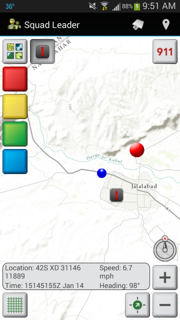

squad-leader-android
====================

The Squad Leader template demonstrates best practices for building handheld military applications with the ArcGIS Runtime SDK for Android. The Squad Leader template contains source code for a handheld application and directions for building the application from source. To download a precompiled distribution of the application, visit [ArcGIS for Defense and Intelligence](http://www.arcgis.com/home/group.html?owner=Arcgisonline_defense&title=ArcGIS%20for%20Defense%20and%20Intelligence).



## Sections

* [Requirements](#requirements)
* [Release Notes](#release-notes)
* [Instructions](#instructions)
    * [Building from Source](#building-from-source)  
    * [Running Unit Tests](#running-unit-tests)
* [Resources](#resources)
* [Issues](#issues)
* [Contributing](#contributing)
* [Licensing](#licensing)

## Requirements

To run the app:

- Android 4.0.1 or higher
  - Limited functionality when running on an Android emulator ([more info](#notes-on-running-with-the-android-emulator))
- In the Android device's settings, if Developer Options are available, ensure that **"Don't keep activites"** or **"Do not keep activities"** is **unchecked**. See the [User Guide](documentation/UserGuide.md#uncheck-dont-keep-activities) for details.

To build the app from source:

- Android SDK
  - Android API 14 or higher
- [ArcGIS Runtime SDK 10.2.4 for Android](https://developers.arcgis.com/en/downloads/)
  - Even if you have installed the Eclipse plugin from the online update site, you'll need to download the SDK to get the native binary files (see [build steps](#building-with-eclipse)).
- Eclipse 3.6.2 or higher (Eclipse for Android recommended)
- Android Support Library

## Release Notes

### 3.1.0

#### What's New in Squad Leader 3.1.0
* Changed geography from Afghanistan to California.
    * IMPORTANT: if you upgrade to 4.1.0 and you don't have your own mapconfig.xml file, you must do one of the following to force Squad Leader to reset the map configuration:
        * In Squad Leader, go to **Settings** and choose **Reset map**.
        * Go to your device's application settings, choose **Squad Leader**, and choose **Clear Data**.
    * You can use mapconfig.xml to adjust the geography as desired.
    * The Afghanistan data files are available in the [3.0.0 release](../../tree/v3.0.0).

### 3.0.0

#### What's New in Squad Leader 3.0.0
* Uses ArcGIS Runtime 10.2.4.
  * If you built Squad Leader with a previous version of ArcGIS Runtime, you need to follow the step in [Building with Eclipse](#building-with-eclipse) below about copying the MIL-STD-2525C symbol dictionary into your clone. ArcGIS Runtime 10.2.4 will not work with older versions of the symbol dictionary.
* Requires Android 4.0.1 or higher
* Viewshed analysis
    * Requires Android 4.1 (Android API level 16) or higher
    * Viewshed requires elevation data on the device. See the [User Guide](documentation/UserGuide.md#configuring-viewshed-analysis) for configuration details.
* GeoMessage management (e.g. chem lights, spot reports, and position reports):
    * The user can remove all messages of a certain type or all messages of all types from the map, with the option to send a remove message for messages created by this user to other clients.
    * The user can modify or remove a chem light.
    * The app recognizes the new "removeall" GeoMessage action, which removes all messages of a certain type:
    ```
        <geomessage v="1.0">
            <_type>chemlight</_type>
            <_action>removeall</_action>
            <_id>{2e50e7ea-c76a-11e4-8731-1681e6b88ec1}</_id>
        </geomessage>
    ```
* Using a client ID and license string that are configurable in strings.xml. Note that the current code only requires a Runtime Basic license, so the license string is optional.
* Disabled the button that hides labels. Hiding labels on military symbols does not work in ArcGIS Runtime 10.2.4 (NIM102986). When the Runtime issue is fixed, we will re-enable the button that hides labels.

## Building from Source

### Building with Eclipse

1. Clone this repository, or fork it and clone your fork.
1. Download and install the ArcGIS Runtime SDK for Android, 
    1. Unzip the SDK
    1. Copy the contents of the `arcgis-android-sdk/libs` directory from the SDK to your clone's `source/SquadLeader/libs` directory. 
    1. NOTE: If app size is an issue and you know you don't need to run Squad Leader on a particular platform, you can omit one or more of the directories (armeabi, armeabi-v7a, x86).
1. Copy the MIL-STD-2525C symbol dictionary into your clone:
    1. If you cloned a previous version of the Squad Leader code, delete the contents of `source/SquadLeader/assets/2525cSymDictionary` except for `.gitignore`.
    2. From the ArcGIS Runtime SDK you unzipped in the previous step, copy the contents of `arcgis-android-sdk/resources/mil2525c` to the `source/SquadLeader/assets/2525cSymDictionary` directory in your Squad Leader clone. In other words, the `messagetypes` directory and the `mil2525c.dat` file go in the `2525cSymDictionary` directory.
1. Check and if necessary install the Android Support Library v7 appcompat 
    1. Follow the [instructions](http://developer.android.com/tools/support-library/setup.html) on the Android support site for checking and/or adding the Android Support Library. 
    1. To verify, from a command prompt, run android and [observe the library is checked](documentation/dev-screen-shots/AndroidSupportLibrary.jpg)
1. Open Eclipse for Android. Some **IMPORTANT NOTES:**
    1. When adding/importing projects to Eclipse ensure that you use the Android Import option:  **Android >  Import Existing Android Code into Workspace**.
    1. This can be found at **File > Import > Android > Existing Android Code Into Workspace**.
    1. When importing code, do not select/check the option copy the project to the workspace unless you know what you're doing.
    1. Once a project has been imported, verify that the Android Property Page contains [no broken links](documentation/dev-screen-shots/SquadLeaderAndroidFixPath.jpg). If so, you will need to remove and re-add the project.
1. Add/import the Android Support Library v7 appcompat into your Eclipse Workspace
    1. In Eclipse import `{Android SDK Home}\sdk\extras\android\support\v7\appcompat`. 
    1. This provides a library project called android-support-v7-appcompat. 
1. Add/import the aFileChooser project and check its properties
    1. The squad-leader-android repo contains the aFileChooser repo as a submodule in the source directory: `squad-leader-android\source\aFileChooser\aFileChooser`
    1. Add/import the aFileChooser Eclipse Android project to the workspace
    1. Check the properties - right-click the project and choose **Properties > Android**. If any of the project's references are broken (e.g. android-support-v7-appcompat), remove it and re-add the reference.
1. Add/import the SquadLeader project and check its properties
    1. Add/import the SquadLeader Eclipse Android project to the workspace from: `squad-leader-android\source\SquadLeader`
    1. Check the properties - right-click the project and choose **Properties > Android**. If any of the project's references are broken (e.g. android-support-v7-appcompat, aFileChooser), remove it and re-add the reference.
    1. Ensure that the SquadLeader project is an ArcGIS Android Project. Right-click the project and choose **ArcGIS Tools > Convert to ArcGIS Android Project** if necessary.
1. If any of the three projects (SquadLeader, android-support-v7-appcompat, aFileChooser) have errors, you may need to try the following:
    1.  You may need to set the Android API level. Right-click the project and choose **Properties > Android**. Choose an Android API level 14 or higher. If you don't have API 14 or higher, install one in Eclipse by choosing **Window > Android SDK Manager** and selecting **SDK Platform** for API 14 or higher.
    1.  Right-click the project and choose **Android Tools > Fix Project Properties**
    1.  Right-click the SquadLeader project and choose **ArcGIS Tools > Fix Project Properties** - If **ArcGIS Tools** does not appear in the context menu, go back to the system requirements above and ensure you haved installed the ArcGIS Runtime SDK 10.2.3 for Android Eclipse Plugin.
    1.  You may also need to clean and re-build the SquadLeader, aFileChooser, and/or android-support-v7-appcompat projects.
1. Open `source/SquadLeader/res/values/strings.xml` and adjust the values of `clientId` and `licenseString` as needed. Refer to [the documentation on licensing an ArcGIS Runtime app](https://developers.arcgis.com/android/guide/license-your-app.htm) for details. Note that the 3.0.0 release of Squad Leader uses only Runtime Basic functionality in ArcGIS Runtime 10.2.4, which means the license string is optional.
1. If you previously built Squad Leader and then upgraded your ArcGIS Runtime SDK for Android, right-click the project and choose **ArcGIS Tools > Fix Project Properties**. This will replace the *.so binaries in your previous build with the binaries in the upgraded SDK.
1. To run directly from Eclipse
    1. Right-click the SquadLeader project and choose **Run As > Android Application**. 
    1. If you wish to run in an emulator, see: [Notes on Running with the Android Emulator](#notes-on-running-with-the-android-emulator)
1. To create an installer (.apk), right-click the project and choose **Export**. Choose **Android > Export Android Application** and step through the wizard.

### Building with Ant

1. The following steps configure the project for building with ant. 
1. IMPORTANT NOTE: the ant and Eclipse configurations are not compatible so should *not* be used together (you should choose one or the other but not both).
1. Configure Android, Java, and Ant to run from the command line
    1.  It is assumed that users who select this option will be familiar with the steps necessary to configure these tools for command line usage (usually just adding the install directory to the path, e.g. for Android, set PATH=%PATH%;{ADT-Install}\sdk\tools)
    1.  If not, please consult the documentation for each tool. 
    1.  To verify that your environment is correctly configured, from a command prompt enter the following and verify each command returns without errors:
        1.  `> android -h`
        1.  `> java -version`
        1.  `> ant -version`
1.  Perform Steps 1-4 from [Building with Eclipse](#building-with-eclipse) for cloning the projects and installing the support library.
1.  For each of the following projects:
    1. `{Android SDK Home}\sdk\extras\android\support\v7\appcompat`
    1. `squad-leader-android\source\aFileChooser\aFileChooser`
    1. `squad-leader-android\source\SquadLeader`
    1. Do the following:
        1. Check/edit the project.properties file to ensure that it points to the correct folder(s)
        1. From the command line change to that directory and run the following command: `> android update project --path .` (Note: this will create an ant build.xml file in each project directory)
1. Edit the file: `squad-leader-android\source\SquadLeader\custom_rules.xml` to point to the correct location of the ArcGIS for Android SDK install (this file is run as part of the build).  
1. From  `squad-leader-android\source\SquadLeader`, build using the desired ant task e.g. : `>ant release`
    1. NOTE: if you receive an error during build: "Could not reserve enough space for object heap," you may need to see the following environment variable from the command prompt: `> SET _JAVA_OPTIONS=-Xmx512M`

## Running unit tests

### Running Unit Tests using Eclipse for Android

1. Follow the [Building with Eclipse](#building-with-eclipse) steps above.
1. In the same Eclipse workspace, add/import the project found at `source/SquadLeader/tests`. The project name is SquadLeaderTest.
1. To run the SquadLeaderTest project, right-click the project and choose **Run As > Android JUnit Test**. 
1. If you wish to run in an emulator, see: [Note on Running with the Android Emulator](#notes-on-running-with-the-android-emulator)

### Running Unit Tests using Ant

1. Once you have configured the project for [building with ant](#building-with-ant)
1. `>ant debug install test`

## Notes on Running with the Android Emulator

1. Like any app using ArcGIS Runtime for Android, Squad Leader can run on an Android emulator.
1. If you wish to run in an emulator, you must follow the directions in [this blog post](http://blogs.esri.com/esri/arcgis/2012/05/02/arcgis-runtime-sdk-for-android-v1-1-supports-android-emulator/) to ensure that the emulator has proper hardware GPU support.
    1. A sample emulator configuration is shown at (documentation/dev-screen-shots/SampleEmulator.jpg)
1. IMPORTANT NOTE: the Android emulator runs in a firewall-restricted sandbox that cannot communicate over UDP with outside processes, meaning you cannot send or receive Geomessages (spot reports, etc.) from or to Squad Leader running on an emulator.

## Notes on Submodules used by the Repo

Squad Leader leverages the following as submodules of the squad-leader-android repository. 

* [military-apps-library-java](https://github.com/Esri/military-apps-library-java) 
* [aFileChooser](https://github.com/iPaulPro/aFileChooser)
 
If you should want to update to the latest commit instead of the commit used by the squad-leader-android commit you're using, you can open a GitHub shell in squad-leader-android and run the following:

  <code>$ cd .\source\military-apps-library-java</code>  
  <code>$ git pull origin master</code>

## User Guide

More information for configuring and running the application see the [User Guide](documentation/UserGuide.md)

## Resources

* Learn more about Esri's [ArcGIS for the Military solution](http://solutions.arcgis.com/military/).

## Issues

Find a bug or want to request a new feature?  Please let us know by submitting an issue.

See [Issues](https://github.com/Esri/squad-leader-android/issues) for a list of known issues.

Of particular note is [issue 84: Squad Leader app freezes when it's been running for some period of time](https://github.com/Esri/squad-leader-android/issues/84) . On some devices, we have noticed that the Squad Leader application will freeze after a few minutes of inactivity. In this situation, the application should be stopped and then started again. This issue will be addressed in a future release.

## Contributing

Esri welcomes contributions from anyone and everyone. Please see our [guidelines for contributing](https://github.com/esri/contributing).

## Licensing

Copyright 2013-2015 Esri

Licensed under the Apache License, Version 2.0 (the "License"); you may not use this file except in compliance with the License. You may obtain a copy of the License at

   http://www.apache.org/licenses/LICENSE-2.0

Unless required by applicable law or agreed to in writing, software distributed under the License is distributed on an "AS IS" BASIS, WITHOUT WARRANTIES OR CONDITIONS OF ANY KIND, either express or implied. See the License for the specific language governing permissions and limitations under the License.

A copy of the license is available in the repository's [license.txt](license.txt) file.

Portions of this code use other Esri libraries, also governed by the Apache License:

- military-apps-library-java

Portions of this code use third-party libraries:

- Use of aFileChooser is governed by the Apache License.
- Use of the JSON Java library available at http://www.json.org/java/index.html is governed by the JSON License.

See [license-ThirdParty.txt](license-ThirdParty.txt) for the details of these licenses.

This repository contains elevation data from the Shuttle Radar Topography Mission (SRTM). See [license-ThirdParty.txt](license-ThirdParty.txt) for dataset citation details.

[](Esri Tags: ArcGIS Defense and Intelligence Military Defense Portal Android ArcGISSolutions)
[](Esri Language: Java)
